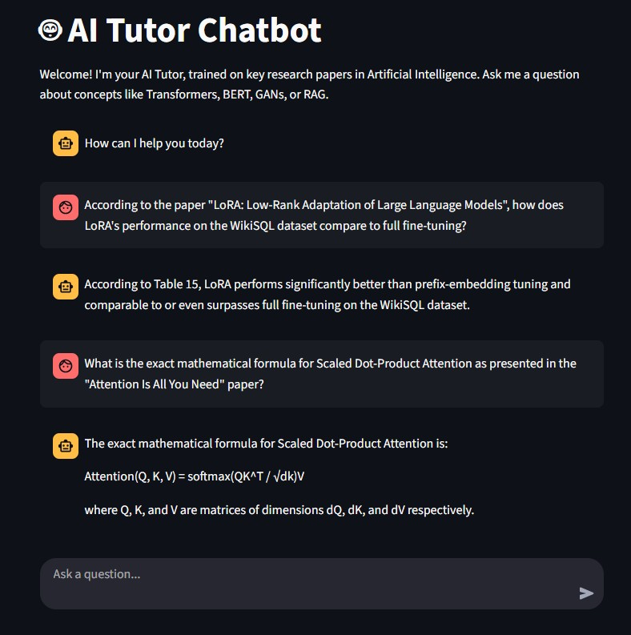

# AI Tutor Chatbot

A sophisticated RAG (Retrieval-Augmented Generation) chatbot designed to answer questions about Artificial Intelligence by referencing a curated knowledge base of key academic papers. This project features a robust FastAPI backend for its core logic and an interactive Streamlit UI for a seamless user experience.

<div align="center">
  
</div>

---

## Key Features

-   **RAG Architecture:** Utilizes a Retrieval-Augmented Generation pipeline to provide answers grounded in factual documents, preventing model hallucination and providing verifiable sources.
-   **Local LLM:** Powered by Llama 3 running locally via Ollama, ensuring privacy and eliminating API costs.
-   **Robust API:** A scalable backend built with FastAPI, providing a well-documented and easy-to-use API endpoint.
-   **Interactive UI:** A user-friendly, real-time chat interface created with Streamlit.
-   **Extensible Knowledge Base:** Easily expand the chatbot's expertise by adding new PDF documents to the `knowledge_base` folder.

---

## How It Works

The application follows a standard RAG pipeline:

1.  **Ingestion & Indexing:** PDF documents from the `knowledge_base` are parsed, split into smaller text chunks, and converted into numerical vectors (embeddings) using a Sentence-Transformer model.
2.  **Vector Store:** These embeddings are stored in a FAISS vector store for efficient similarity search. This step is performed by `process_data.py`.
3.  **Retrieval:** When a user asks a question, it is converted into an embedding. The FAISS index is then queried to find the most semantically similar text chunks from the original documents.
4.  **Generation:** The retrieved text chunks (context) and the original question are passed to the Llama 3 model with a specific prompt, which then generates a comprehensive answer based on the provided context.

---

## Tech Stack

<div align="center">
  
  
  
  
  
  
  
  
</div>

---

## Setup and Installation

Follow these steps to get the project running on your local machine.

### 1. Prerequisites

-   Python 3.10 or higher
-   [Ollama](https://ollama.com/) installed and running.
-   [Docker Desktop](https://www.docker.com/products/docker-desktop/) installed (for containerized deployment).

### 2. Clone the Repository

```bash
git clone [https://github.com/alborzbm/AI-Tutor-Chatbot]
cd AI-Tutor-Chatbot
```

### 3. Create and Activate a Virtual Environment

```bash
# For Windows
python -m venv venv
.\venv\Scripts\activate

# For macOS/Linux
python3 -m venv venv
source venv/bin/activate
```

### 4. Install Dependencies

```bash
pip install -r requirements.txt
```

### 5. Set up Ollama

Ensure the Ollama service is running on your host machine and that you have pulled the required model:

```bash
ollama pull llama3.2:latest
```

### 6. Prepare the Knowledge Base

Place your academic papers (in PDF format) into the `knowledge_base` directory, then run the data processing script to build the vector store:

```bash
python process_data.py
```
This command creates a `faiss_index` folder, which serves as the chatbot's memory.

---

## Usage

There are two primary ways to run this application: fully local for development, or with a Dockerized backend.

### Option 1: Local Development

Run the backend and frontend in two separate terminals.

**1. Run the Backend (FastAPI):**
In your first terminal (with the virtual environment activated):

```bash
uvicorn main:app --reload
```
The API will be available at `http://127.0.0.1:8000`.

**2. Run the Frontend (Streamlit):**
In a second terminal (with the virtual environment activated):

```bash
streamlit run ui.py
```
A new tab will open in your browser with the chat interface.

### Option 2: Dockerized Backend with Local Frontend

This is a great way to test the containerized service.

**1. Build and Run the Docker Container:**
First, ensure your `chatbot.py` file uses `base_url="http://host.docker.internal:11434"` for Ollama. Then, build and run the container:

```bash
# Build the image
docker build -t ai-tutor-chatbot .

# Run the container
docker run -d -p 8000:8000 --name my-ai-tutor ai-tutor-chatbot
```
The backend API is now running inside Docker.

**2. Run the Frontend (Streamlit):**
Run the Streamlit UI locally, which will connect to the Dockerized backend.

```bash
streamlit run ui.py
```

---

## Knowledge Base Content

The knowledge base for this chatbot was built using several foundational papers in AI, including:

-   "Attention Is All You Need" (The Transformer)
-   "BERT: Pre-training of Deep Bidirectional Transformers..."
-   "LoRA: Low-Rank Adaptation of Large Language Models"
-   "Retrieval-Augmented Generation for Knowledge-Intensive NLP Tasks" (RAG)
-   "Chain-of-Thought Prompting Elicits Reasoning in Large Language Models"
-   And several others.

---

## Project Structure

```
AI-Tutor-Chatbot/
├── .venv/                  # Python virtual environment
├── faiss_index/            # Generated vector store
├── knowledge_base/         # Directory for your PDF documents
├── chatbot.py              # Core chatbot logic (RAG Chain)
├── main.py                 # FastAPI server
├── process_data.py         # Script to process PDFs and build the knowledge base
├── ui.py                   # Streamlit user interface
├── app_screenshot.jpg      # Screenshot of the UI
├── Dockerfile              # Instructions for building the Docker image
├── .dockerignore           # Specifies files to ignore in the Docker build
└── requirements.txt        # Project dependencies
```

---

## License

This project is licensed under the MIT License. See the `LICENSE` file for details.

---

## Author

**Alborz Babazadeh**
<br/>
<a href="https://www.linkedin.com/in/alborzbabazadeh/">
  
</a>
<a href="https://github.com/alborzbm">
  
</a>
